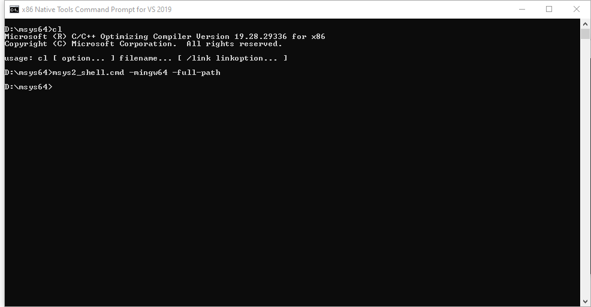
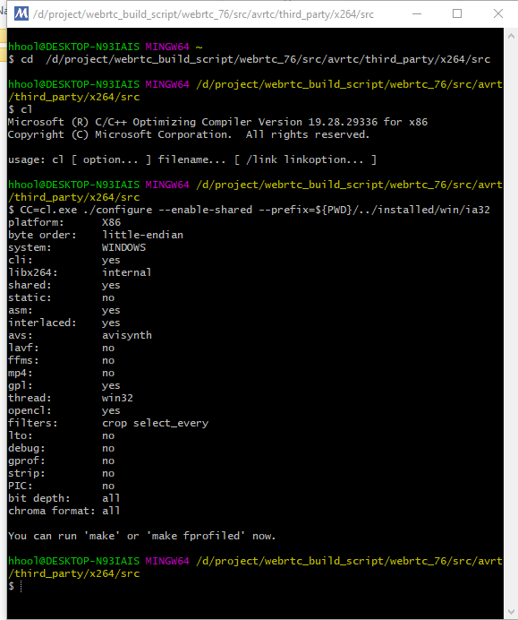
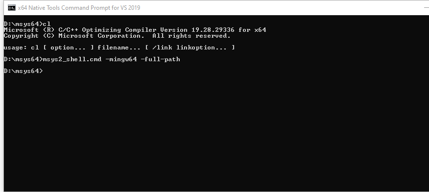
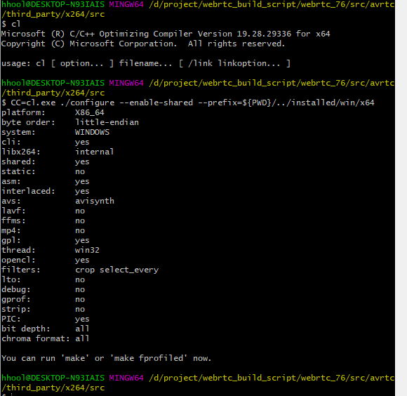

#
## get code
```
wget https://download.videolan.org/pub/videolan/x264/snapshots/x264-snapshot-20191217-2245.tar.bz2
tar xvf x264-snapshot-20191217-2245.tar.bz2
mv x264-snapshot-20191217-2245 src
```
## build
`windows`
```
ide vs2019 professional
wget https://repo.msys2.org/distrib/x86_64/msys2-x86_64-20201109.exe
Install and update msys environment
https://www.msys2.org
```
`x86`





`x64`





`android`
```
download: android-ndk-r22 (linux)

NDK_ROOT=path_to_android-ndk-r22 android_build.sh
```

